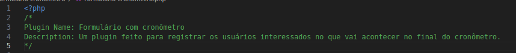

# wp-plugin-boilerplate
Um boilerplate para auxiliar no aprendizado de desenvolvimento de plugins para Wordpress.

## Passo-a-Passo para chegar na branch "finalizado"
### Passo 1
O primeiro passo é preparar o ambiente de desenvolvimento. Todas as etapas necessárias estão contidas nessa página:
https://residenciaticbrisa.github.io/T2G8-Plugin-Wordpress/#/preparandoambiente

### Passo 2
O segundo passo é definir o cabeçalho do nosso plugin. Lá estará as informações essenciais sobre nosso plugin como nome, versão, autores, descrição, etc. Para uma lista completa de campos disponíveis acesse a página oficial de desenvolvimento de plugins para WordPress: 
https://developer.wordpress.org/plugins/plugin-basics/header-requirements/

O cabeçalho:  

### Passo 3
Vamos definir a estrutura das nossas pastas e arquivos. Alguns já estão criados, então vamos finalizar o restante para que fique assim: 